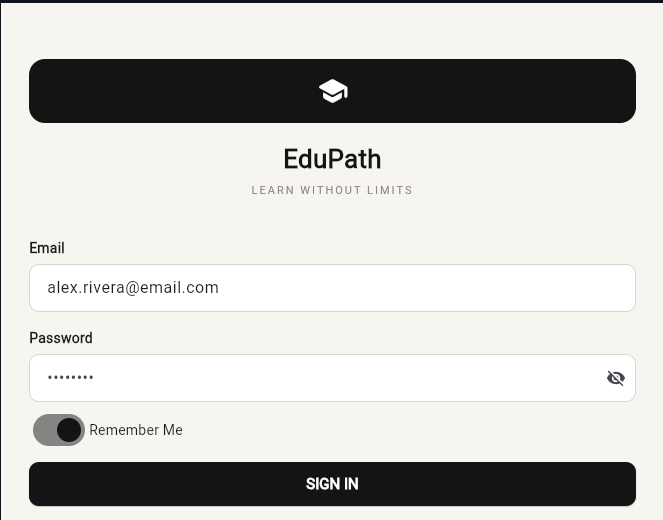
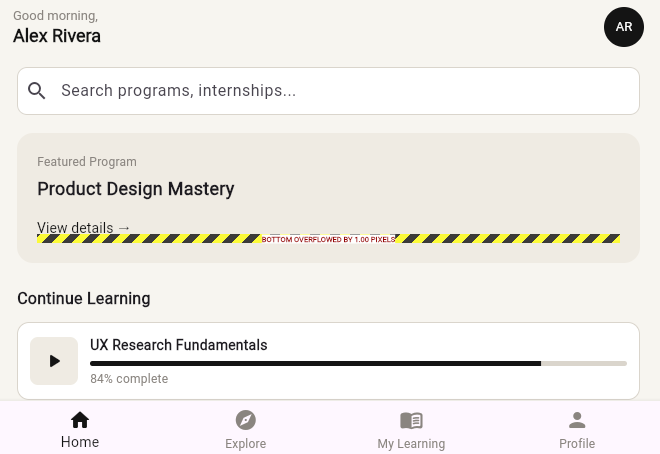

# flutter_learnify
# App - Flutter Project

## Project Vision & Objectives
Provide an accessible, easy-to-use mobile platform for learners to discover and track educational programs and virtual internships.

## Navigation Flow
Login Screen ➡️Home Screen ➡️ Program Listing ➡️ Program Details / Profile

## Setup & Running
1. Clone this repository: `git clone <https://github.com/meymoonaX/flutter_app.git>`
2. Run `flutter pub get`
3. Launch on emulator/device using `flutter run`
## Screens | Screen | Description | |---|---| | Login | Email/password sign-in with validation | | Home | Dashboard with featured program and "Continue Learning" progress | | Program Listing | Searchable, filterable list of all programs | | Program Details | Overview/Syllabus/Reviews tabs with Enroll button | ## Screenshots     ## Running the app ``` flutter pub get flutter run ```
